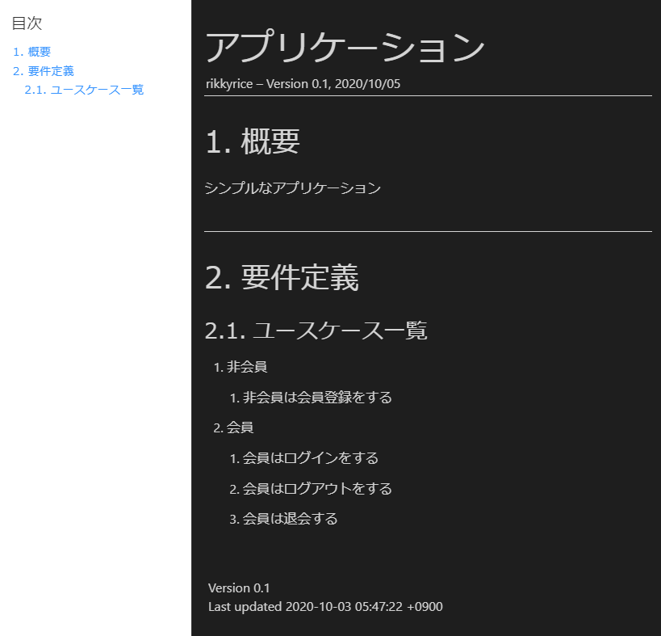
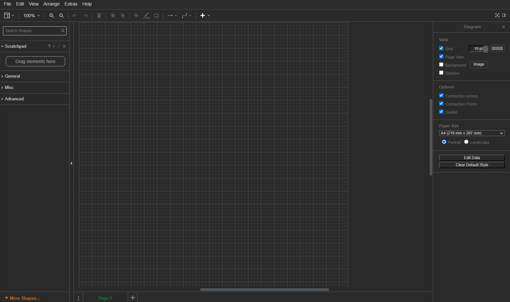
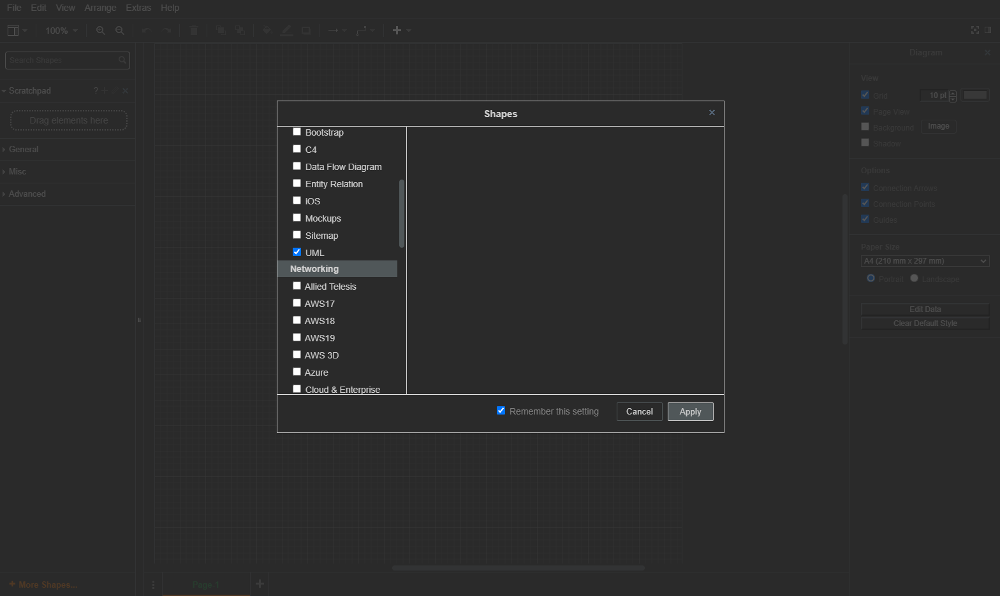
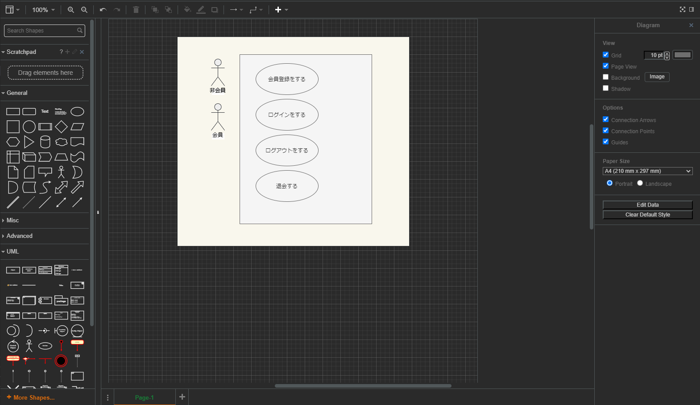
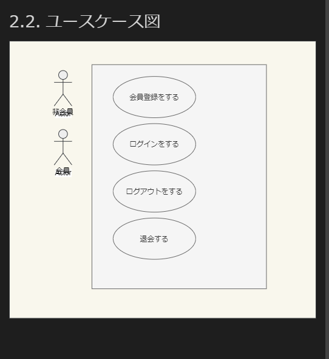

# Asciidocとdraw.ioを使ってユースケースを作る

## 概要
こんにちは。
今回は何か新しいアプリケーションを作りたいや、プロジェクトを始めた時に、wordやexcelを使うのではなく、git管理もしやすい、Asciidocとdraw.ioを使って、簡単にユースケースを作っていく方法を紹介します。
全部VSCode一つあれば完結するので、非常に便利です。

##　開発環境
* Win10 Enterprise
* VSCode v1.49.2
  * AsciiDoc v2.8.3(Extensions)
  * Draw.io Integration v0.7.2(Extensions)

## Asciidocとは？
Asciidocはマークアップ言語です。
一般的に軽量マークアップ言語といえばMarkdownが思い浮かびますが(Qiita記事もMarkdown記法ですね)、
AsciidocはMarkdownよりも多彩な表現方法があります。
外部ファイルを埋め込んだり、目次の自動生成が簡単に行える点も魅力です。

### 導入
導入も非常に簡単で、VSCodeにExtensionを追加するだけで使えます。
導入するExtensionはこちら[https://marketplace.visualstudio.com/items?itemName=asciidoctor.asciidoctor-vscode]です。

導入後は拡張子.adocでファイルを作成し、公式ドキュメント[https://asciidoctor.org/docs/asciidoc-syntax-quick-reference/]など
参考にしながらゴリゴリ書いていきます。

プレビュー表示も簡単です。
VSCodeで開いているエディター画面の右上に`Open Preview to the Side`のアイコンがあるのでそれをクリックするだけですね。

## draw.ioとは?
いわゆる作画ツールです。
本来はdraw.ioサイトで作画し、ダウンロードやクラウドにアップロードして図を使う形でしたが、
VSCodeで作画ができるようになり、その便利さはExcelなんか使うことがバカバカしくなるレベルです。(Excel派のみなさんすいません)
しかも、drawioは以下の拡張子で保存することができ、
* .dio
* .drawio
* .drawio.png
* .drawio.svg
特に下二つに関しては、マークアップ言語に直接画像として埋め込めるのです!

つまりpngやsvgにexportすることなく、.draw.svgでファイルを作成し、作画するだけで、
もうその画像が利用できるわけですね！なんていう便利さでしょうか。

Excel時代は重いアプリケーションを使いながら作画して画像保存してそれを貼り付けてとかしてましたけども。

### 導入
こちらも導入簡単です。例に倣ってVSCodeにExtensionを追加するだけです。
導入するExtensionはこちら[https://marketplace.visualstudio.com/items?itemName=hediet.vscode-drawio]。

後は、拡張子を上で挙げたどれかでファイルを作って開くと、
エディタが表示されます。
後はExcel感覚で図や依存関係を矢印で追加していくだけで視覚的に作図していきます。

## 本題
ここからが本題です。
早速ユースケースを作っていきましょう。
今回は単純に会員登録してログインできるというアプリケーションのユースケースを作っていきます。

### ユースケース一覧
まずアクターは以下二つが考えられます。
1. 非会員
2. 会員
非会員が会員登録して、会員はログインするという流れになります。

したがって、考えられるユースケース一覧は以下のようになると考えられます。
1. 非会員
   1. 非会員は会員登録をする
2. 会員
   1. 会員はログインをする
   2. 会員はログアウトをする
   3. 会員は退会する

非常にシンプルなユースケースですね。
今回はこのユースケースに基づいて図と記述を作っていきます。

### Asciidoc作成
ではここまでの仕様書をAsciidocで書いていきます。
VSCodeでNew File、`project.adoc`を作ります。
コードは以下のようにします。
```Asciidoc
:lang: ja
:doctype: book
:toc: left
:toclevels: 4
:toc-title: 目次
:sectnums:
:sectnumlevels: 4
:imagesdir: images
:figure-caption: 図
:docname: = アプリケーション
:author: rikkyrice
:revnumber: 0.1
:revdate: 2020/10/05

= アプリケーション

== 概要

シンプルなアプリケーション

== 要件定義

=== ユースケース一覧
. 非会員
[arabic]
.. 非会員は会員登録をする
. 会員
[arabic]
.. 会員はログインをする
.. 会員はログアウトをする
.. 会員は退会する

```

Markdownと違う点は最初のドキュメントヘッダーでしょうか。
HTMLのヘッダーのようなもので、
Asciidocの出力形式を定義しています。

`toc`というのは目次を生成する機能を持っており、
左側に4レベルまで目次を生成する指定をしています。

`imagesdir`ですが、こちらは参照する画像フォルダの指定ができます。
おそらくファイルが存在するディレクトリからの相対パスを指定することになります。
この設定では、`project.adoc`と同じディレクトリの`images`フォルダ配下のimageを参照しに行くことになります。

プレビューは以下のようになります。


### ユースケース図の作図
それでは`draw.io`を使って作図していきます。
まず`project.adoc`と同じディレクトリの配下に`images`ディレクトリを作成します。
次に`images`ディレクトリ配下に`usecase-diagram.drawio.svg`を作成します。
ファイルを開くと以下のようなエディタが現れます。



このままでも作図できますが、さらに便利な図形のグループがあるので、
`+ More Shapes...`をクリックし、`Software/UML`にチェックを入れてApplyします。



これでUMLでよく使うアクターやユースケースが使えるようになりました。

今回は以下のようなユースケース図を、ユースケース一覧を参考にして作成しました。



それでは早速これをAsciidocに埋め込みましょう。
埋め込むコードは以下になります。
```Asciidoc
=== ユースケース図
image::usecase-diagram.drawio.svg[format=svg]
```

するとこんな感じで、プレビューに反映されます。



マジで便利ですね。

### ユースケース記述
ここではユースケース記述を他のAsciidocに書いて、`project.adoc`にリンクを埋め込みます。

例えば、`project.adoc`と同じディレクトリに`usecases`ディレクトリを作って、そこに`非会員は会員登録をする`を作成してみましょう。

コードは以下のようにします。

```Asciidoc
:lang: ja
:doctype: book
:toc: left
:toclevels: 4
:toc-title: 目次
:sectnums:
:sectnumlevels: 4
:sectlinks:
:docname: = 非会員は会員登録をする
:author: rikkyrice
:revnumber: 0.1
:revdate: 2020/10/03

= 非会員は会員登録をする

== ユースケース概要

.ユースケース概要
|===

|業務領域名 |会員登録処理

|ユースケースID
|UC3_001

|ユースケース名
|非会員は会員登録をする

|概要
|会員でないユーザーは会員登録をしてサービスの利用を受けることができる

|主アクター
|非会員

|関連アクター
|

|関連プロセス
|会員登録ページ

|ビジネス・イベント
|

|事前条件
a|. サイトにアクセス、会員登録をまだ行っていない

|事後条件
a|
. 会員登録に成功した場合 
    * ログインした後のトップページを表示
. 会員登録に失敗した場合
    * 会員登録画面にてエラーメッセージを表示 
|===

== イベントフロー
=== 基本フロー
. 非会員はユーザーID、メールアドレス、パスワード、確認用パスワードを入力し、登録ボタンを押下する[会員登録画面]
. システムは、入力チェック(必須項目のNULLチェック、正規表現チェック)を行う[AF1]
. システムは、入力されたユーザーIDがすでに存在しないか確認する[AF2]
. システムは、パスワードと確認用パスワードが一致しているかを確認する[AF3]
. システムはログインした後のトップページを表示する。ユーザーの名前をメニューバーに表示する[ログイン後トップページ]
. このユースケースを終了する

=== 代替フロー
==== AF1: 入力チェックが失敗した場合
. システムは、エラーメッセージ(例:ユーザーIDが入力されていません。)を表示する。[会員登録画面]
. 基本フロー1に戻る

==== AF2: 入力されたユーザーIDがすでに存在した場合
. システムは、エラーメッセージ(例:このユーザーIDはすでに使われています)を表示する。[会員登録画面]
. 基本フロー1に戻る

==== AF3: 入力されたパスワードと確認用パスワードが一致していない場合
. システムは、エラーメッセージ(例:パスワードと確認用パスワードが一致しません)を表示する。[会員登録画面]
. 基本フロー1に戻る

== データフロー定義

.データフロー定義
[cols="2*", options="header"]
|===
|情報名
|説明(主要項目など)

|ユーザー
a|ユーザー情報をデータベースに登録する +
(ユーザーID, メールアドレス, パスワード)
|===

== 補足事項

== 関連ドキュメント
project.adoc#要件定義
```

これを`project.adoc`で参照できるようにします。

私の場合は以下のようにしてみました。

## まとめ

## 参考資料